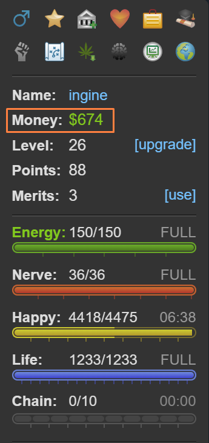

# Torn City

Torn offers a unique gaming experience that stands out from the rest. Unlike fleeting thrills, Torn is a commitment to long-term engagement without a predefined endpoint. It thrives on the satisfaction of delayed rewards, distinguishing itself and offering a uniquely fulfilling journey.

In the realm of gaming, Torn serves as a sanctuary—a completely free-to-play haven untainted by pay-to-win tactics. You won't encounter coercive in-app purchases that demand your money for quick power-ups. Under the careful stewardship of Chedburn, the game remains steadfast against exploiting its players, ensuring a fair environment where real money is optional and intrusive ads are practically non-existent.

Like any vibrant community, Torn hosts a mix of supportive individuals and more dubious characters. Navigating potential pitfalls is straightforward with vigilance, especially given that the game permits scamming.

The community, vast and generally supportive, rewards respect and engagement. Torn's intricacies defy comprehensive guides, yet essential advice is invaluable for both newcomers and returning veterans alike.

Often labeled a "criminal game," Torn allows players to partake in attacks and illicit activities, although beginners start at a disadvantage compared to seasoned players. Starting quietly, honing combat skills, building alliances within your faction, and savoring the journey are prudent steps. While the allure of criminal pursuits is undeniable, progressing steadily and cautiously fortifies your standing in the game.

## Essentials
Let's delve into the fundamentals. In Torn, players are presented with a multitude of gameplay options, each requiring a solid grasp of the game's core mechanics. Below, we outline some essential basics to ensure you're well-equipped to navigate this diverse gaming experience.

### Networth
A player's net worth (referred to as `NW` by many) is essentially a reflection of their total assets, including cash, items, and the value of properties or stocks in the bazaar. It holds significant importance in Torn as it determines your ability to engage in various activities, such as purchasing assets, placing bounties, or even engaging in happy jumping from the outset. While certain items like merits and mission points require effort to acquire, having sufficient cash or belonging to a capable faction—such as ours 😉—can expedite your access to these opportunities.

#### Money

The highlighted section in the sidebar above represents your immediate cash on hand in Torn. It's important not to accumulate too much, as this is the money vulnerable to theft. According to the official Torn wiki,
> The base percentage you are able to steal from a player is 5%. This value is then modified with a multi-dice-roll RNG up to 10%, however lower percentages closer to 5% are favoured and values close to 10% would be extremely rare.

Therefore, having a large amount of cash makes you a target for theft if you're frequently found with it.

!!! Note "Mugging is common"
    Mugging is a common occurrence in Torn and a significant means of in-game earning. If you find yourself frequently targeted, don't be discouraged. Instead, consider using secure options like the bank, stocks, your property's vault, or the faction vault to safeguard larger sums of money.

### Battle Stats
Battle stats are crucial in Torn for activities like mugging, defeating opponents, and asserting dominance. They significantly influence your effectiveness in faction wars, where you might find yourself a target rather than the aggressor.

There are four stats: Strength, Speed, Defense, and Dexterity. Each stat offers distinct advantages, so focusing on one or two at the expense of others is initially discouraged. Building up all stats to 250,000 each should be your primary goal early on. This balanced approach ensures you are well-rounded and capable in various situations. Once you achieve this milestone, you can explore more specialized strategies and delve into advanced guides to further refine your gameplay.

The table below provides a basic overview of what each stat is used for:

| Stat      | Description                                                                                         |
|-----------|-----------------------------------------------------------------------------------------------------|
| Strength  | Increases the damage you deal each hit.                                                              |
| Defense   | Reduces the damage you take per hit.                                                                 |
| Speed     | - Increases the chance of hitting your opponent.                                                      |
|           | - Decreases your opponent's chance of escaping from you.                                              |
| Dexterity | - Increases your chance of dodging an attack.                                                         |
|           | - Increases your chance of stealthing an attack.                                                      |
|           | - Decreases your opponent's chance of stealthing an attack.                                           |
|           | - Increases your chance of escaping from an opponent.                                                 |

There are several ways to boost your battle stats in Torn, with the primary methods being energy training and using army job points to target specific attributes. For detailed strategies and specifics on each method, refer to the Torn Wiki [here](https://wiki.torn.com/wiki/Battle_Stats).

