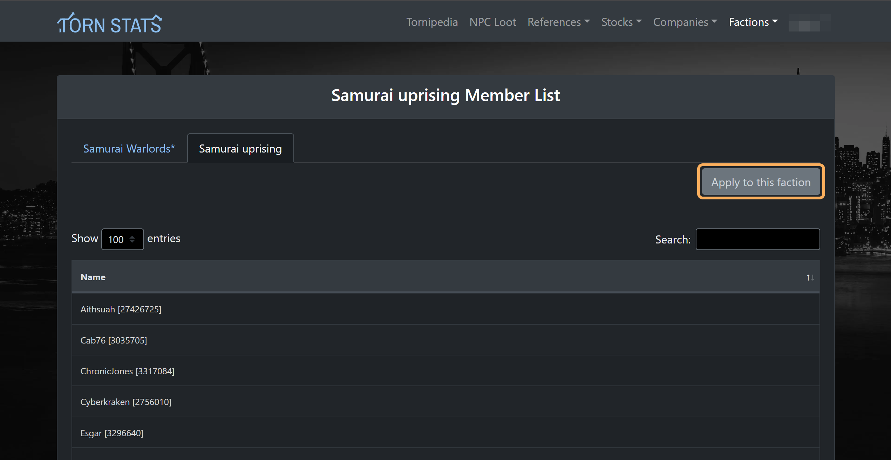

[TornStats](https://tornstats.com/) is a valuable tool that provides detailed statistics and insights into your Torn gameplay. As a faction member, you'll be sharing details like your battle stats, natural nerve bar etc. If you haven't signed up already follow these steps to set it up:

## Sign up
Signing up in Torn Stats is easy. Just go to the [Torn Stats](https://tornstats.com/) website and sign up
 
 

!!! Note "Torn Stats operates independently" 
    When you create an account on Tornstats, it operates independently from Torn itself. Tornstats focuses solely on using your Torn API key and Torn ID. It doesn't interact with your actual Torn game account beyond needing these two pieces of information. In essence, Tornstats is a separate service that uses data from Torn, but it doesn't affect your Torn gameplay or account directly.

## Battle Stats
One of the major features on Torn Stats is that it lets you view your rate of growth on battle stats. Once you've applied to a faction which we will be doing later on, it also shares it to the faction so we can view who you best score on during wars.

To view your battle stats just click the Torn Stats icon on the page:

## Apply to faction
1. Once you've signed up go to Factions > View Factions
     
     
    

- Search for Samurai Uprising and make sure it's ours
     
     
    

- Click on the faction and then hit apply
     
     
    
